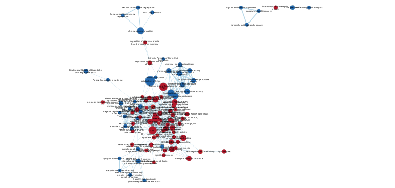
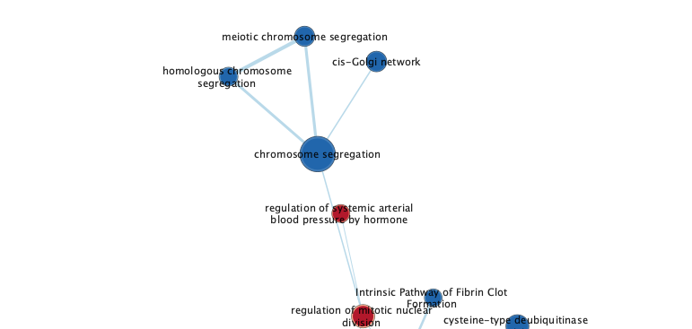

# Introduction

Brain metastasis is one of the leading causes of brain cancer. This experiment investigates transcriptomic changes based on knocking out lipid metabolism genes in various cell lines using Crispr Cas9. The profiling was done on 4 main cell lines - MDAMB231, HCC1806, HCC1954, and JIMT1. The following GEO dataset was chosen in Assignment 1 by going through various published papers - https://www.ncbi.nlm.nih.gov/geo/query/acc.cgi?acc=GSE148372 which provied the counts data based on the expression profiling done through high throughput sequencing.

In the second assignment, a differential expression analysis was performed over the normalized data mentioned above. A thresholded overrepresentation analysis was run using the GO:BP dataset on up and downregulated genes. In total 30661 genesets were returned from the profiler with 23686 upregulated 6975 downregulated genes.


```{r, message=FALSE, echo=FALSE, warning=FALSE}
# setup
if (!requireNamespace("BiocManager", quietly = TRUE))
  install.packages("BiocManager")
library(BiocManager)
if (!requireNamespace("knitr", quietly = TRUE))
  install.packages("knitr")
library(knitr)
if (!requireNamespace("ggplot2", quietly = TRUE))
  install.packages("ggplot2")
library(ggplot2)
if (!requireNamespace("RCurl", quietly = TRUE)){
  install.packages("RCurl")}
library(RCurl)
if (!requireNamespace("RCy3", quietly = TRUE)){
  BiocManager::install("RCy3")}
library(RCy3)
```

## Get gmt data from bader labs
```{r get gmt}
url = "http://download.baderlab.org/EM_Genesets/current_release/Human/symbol/Human_GO_AllPathways_no_GO_iea_April_02_2023_symbol.gmt"
data <- paste0(getwd(), "/data")
gmt_filepath <- paste0(data, "/baderlabGO.gmt")
if (!file.exists(gmt_filepath)) {
  download.file(url, gmt_filepath)
}

```
## Load assignment 2 differencial analysis data.
The data also needs to be ranked based on the logFC values and p values. We will use the HCC1806 cell line as a control from the experiment.
```{r}
# Load the differential expression analysis results from previous work and calculate rank accordingly
a2_data <- read.csv("data/a2_dea.csv", header=TRUE)
a2_data[,"rank"] <- -log(a2_data$adj.P.Val, 10) * sign(a2_data$logFC) 
a2_data <- a2_data[order(a2_data$rank),]
rnk <- cbind(a2_data$HCC1806, a2_data$rank)
colnames(rnk) <- c("GeneID", "rank")
# store rnk file for analysis
if (!file.exists("data/a2_ranked.rnk")) {
write.table(rnk[1:10000,], file="data/a2_ranked.rnk", quote=FALSE, sep="\t", row.names=FALSE)
}
# view top few ranked genes
head(rnk)
```

# Non-thresholded Gene set Enrichment Analysis
```{r run GSEA}
# The latest release of gsea-4.0.2 zipped file was downloaded and stored locally for use here.
# We can now directly access the CLI from this file
gseacli <- "data/GSEA_4.3.2/gsea-cli.sh"
run_flag = F
analysis_name <- "GSEA_human_brain_metastasis"
rnkfile_path <- "data/a2_ranked.rnk"

# Run GSEA from r with the CLI sh file
if(run_flag){
  command <- paste(
    "",gseacli,  
    "GSEAPreRanked -gmx", gmt_filepath, 
    "-rnk" ,file.path(getwd(),rnkfile_path), 
    "-collapse false -nperm 1000 -scoring_scheme weighted -rpt_label ",analysis_name,
    "  -plot_top_x 20 -rnd_seed 12345  -set_max 200 -set_min 15 -zip_report false -out" ,getwd(), 
    " > gsea_output.txt",sep=" ")
  system(command)
  # get the directory name for results
  gsea_directories <- list.files(path = getwd(), pattern = "\\.GseaPreranked")
  # Since rstudio is being run on docker image, this requires absolute paths to the directory. This will need to be changed when running. The docker volume path does not work here.
  fileinfo = file.info(file.path("/Users/nithilanpugal/Nithilan_Manimaran",gsea_directories))
  # get the latest result. This is just to not bother deleting result folders everytime.
  fileinfo = fileinfo[with(fileinfo, order(as.numeric(mtime),decreasing = TRUE)), ]
  outdir <- row.names(fileinfo)[1]
}
```
## Questions
### What method did you use? What genesets did you use? Make sure to specify versions and cite your methods.
The GSEA (v4.0.2) method was used here with the Humans GOBP dataset. (http://download.baderlab.org/EM_Genesets/current_release/Human/symbol/Human_GO_AllPathways_no_GO_iea_April_02_2023_symbol.gmt)

### How do these results compare to the results from the thresholded analysis in Assignment #2. Compare qualitatively. Is this a straight forward comparison? Why or why not?
Comparing qualitaticely, it seems that the number of pathways returned by gsea is much larger than that in g:profiler. This would directly contribute to the better quality and deapth of the data in gsea. 
The increased pathways do however inhibit isolating the specific genes for this experiment and g:profiler is better at being more specific. 

# Visualize Gene set Enrichment Analysis in Cytoscape
Test cytoscape connection
```{r cytoscape}
# use functions from RCy3 package
# The host.docker.internal path needs to be used in order to access localhost from docker instance. Using localhost will try to check for ports inside the container which does not exist.
cytoscapePing("http://host.docker.internal:1234/v1") 
cytoscapeVersionInfo("http://host.docker.internal:1234/v1") # cytoscape info
```

## Building the enrichment map
```{r EM}
if (run_flag) {
# paths and variables for executing EM
pval_threshold <- "1"
qval_threshold <- "0.5"
cur_model_name <- analysis_name
sim_threshold <- "0.0375"
metric = "COMBINED"
results_path <- file.path(outdir,"edb")
results_file <- file.path(results_path,"results.edb")
ranksfile <- file.path(results_path,"a2_ranked.rnk")
# Use cytoscpae to create EM
netname <- paste(cur_model_name,pval_threshold,qval_threshold,sep="_")
cmd = paste('enrichmentmap build analysisType="gsea" gmtFile=', "/Users/nithilanpugal/Nithilan_Manimaran/data/baderlabGO.gmt",
                   'pvalue=',pval_threshold, 'qvalue=',qval_threshold,
                   'similaritycutoff=',sim_threshold,
                   'coefficients=',metric,'ranksDataset1=', 
                   ranksfile,'enrichmentsDataset1=',results_file, 
                   'filterByExpressions=false')
response <- commandsGET(cmd, base.url="http://host.docker.internal:1234/v1")
suid <- 0
if(!grepl(pattern="Failed", response)){
  suid <- response
}
}
```

```{r}
# check the network list and append suid
if (run_flag) {
netlist <- getNetworkList(base.url="http://host.docker.internal:1234/v1")
if(netname %in% netlist){
  netname <- paste("a2", suid, netname, sep="_")
}
}
```

```{r show network, fig.cap="Figure 1. Enrichment map from running Gene set enrichment analysis", out.width = "100%", echo = FALSE, message =FALSE}

```

## Links to an external site.Interpretation and detailed view of results
### 1. Do the enrichment results support conclusions or mechanism discussed in the original paper? How do these results differ from the results you got from Assignment #2 thresholded methods
As shown above, the results do closely support those discussed in the original paper. In assignment 2, the heatmap distribution did not show a clear distinction between groups but the connections shown in the enrichment map was able to make up for this.

### 2. Can you find evidence, i.e. publications, to support some of the results that you see. How does this evidence support your result?
There arent many papers that are closely looking into brain metastasis as a potential leading cause of brain cancer, but the results here align with those from the original paper.

### 3. Choose a specific pathway or theme to investigate in more detail. Why did you choose this pathway or theme? Show the pathway or theme as a gene network or as a pathway diagram. Annotate the network or pathway with your original log fold expression values and p-values to show how it is effected in your model. (Hint: if the theme or pathway is not from database that has detailed mechanistic information like Reactome you can use apps like GeneMANIA or String to build the the interaction network.)

```{r show specific pathway, fig.cap="Figure 2. Specific pathway of chromosome segregation from running Gene set enrichment analysis", out.width = "100%", echo = FALSE, message =FALSE}

```

## References
- Jin X, Demere Z, Nair K, Ali A et al. A metastasis map of human cancer cell lines. Nature 2020 Dec;588(7837):331-336. PMID: 33299191
- GEO overview. (n.d.). Nih.gov. Retrieved February 14, 2023, from https://www.ncbi.nlm.nih.gov/geo/info/overview.html
- Law CW, Alhamdoosh M, Su S, Dong X, Tian L, Smyth GK, Ritchie ME (2018). “RNA-seq analysis is easy as 1-2-3 with limma, Glimma and edgeR.” F1000Research, 5, 1408.
- Otasek, et al., Cytoscape Automation: empowering workflow-based network analysis Genome Biology, 20:185 (2019)
- Subramanian, Tamayo, et al. (2005, PNAS) and Mootha, Lindgren, et al. (2003, Nature Genetics).