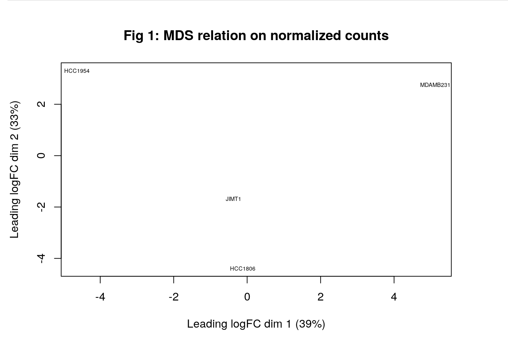
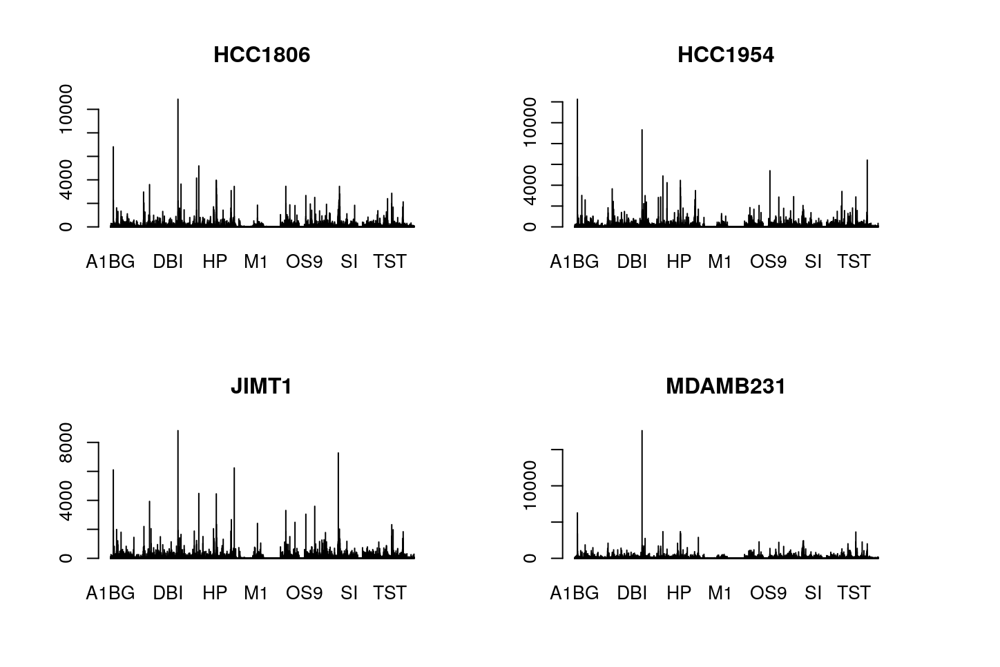

---
title: "Assignment 2"
output: html_document
author: Nithilan Manimaran
date: "2023-03-14"
---

```{r,include=FALSE}
## packages
if (! requireNamespace("knitr", quietly = TRUE)) {
  install.packages("knitr")
}
if (! requireNamespace("dplyr", quietly = TRUE)) {
  install.packages("dplyr")
}
if (! requireNamespace("BiocManager", quietly = TRUE)) {
  install.packages("BiocManager")
}
if (! requireNamespace("limma", quietly = TRUE)) {
  BiocManager::install("limma")
}
if (! requireNamespace("edgeR", quietly = TRUE)) {
  BiocManager::install("edgeR")
}
if (! requireNamespace("ComplexHeatmap", quietly = TRUE)) {
  BiocManager::install("ComplexHeatmap")
}
if (!requireNamespace("EnhancedVolcano", quietly = TRUE)) {
    BiocManager::install("EnhancedVolcano")
}
if (!requireNamespace("gprofiler2", quietly = TRUE)) {
    install.packages("gprofiler2")
}
library(Biobase)
library(knitr)
library(edgeR)
library(limma)
library(dplyr)
library(EnhancedVolcano)
library(ComplexHeatmap)
library(gprofiler2)
```

## Introduction

* Brain metastasis is one of the leading causes of brain cancer. This experiment investigates transcriptomic changes based on knocking out lipid metabolism genes in various cell lines using Crispr Cas9. The profiling was done on 4 main cell lines - MDAMB231, HCC1806, HCC1954, and JIMT1. The following GEO dataset was chosen in Assignment 1 by going through various published papers - https://www.ncbi.nlm.nih.gov/geo/query/acc.cgi?acc=GSE148372 which provied the counts data based on the expression profiling done through high throughput sequencing.

* Our experiment will look into how each cell line differently reacted to the knocking out of metabolism genes and therefore we will be sampling based on cell_lines. This will be done in a pool of 40 divided equally into the 4 kinds of cell lines.

* Assignment 1 has handled most of the data cleaning and provides us with the mormalized data counts for each of these cell lines which will be used for the rest of this paper. The data was normalized using the TMM method and showed that some cell lines cluster together in the MDS plot showing higher coherence. Some visualizations from the previous findings - 

```{r MDS, fig.cap="\\label{fig:MDS}Figure 1. Multidimensional Scaling (MDS) plot with age group coloring, with the clustering of samples based on gene expression data."}
### MDS plot to see relations between counts of different cell lines in the experiment

### Gene representation for each cell line

```


### Fetch data
* Load the normalized counts data aggregated from Assignment 1
* Create a sampling matrix to run our experiment as explained in the introduction

```{r, echo=FALSE}
normalized_count_data <- read.table("data/normalized_counts",
                                    header = TRUE,
                                    sep = ",",stringsAsFactors = FALSE,
                                    check.names=FALSE)
normalized_count_data <-normalized_count_data[match(
  unique(normalized_count_data$gene), 
  normalized_count_data$gene), ]
head(normalized_count_data)
```

* Creating a list of samples
* This study focuses on how different cell lines are affected by the corresponding genes and therefore our sample will simply be a mix of the 4 cell_lines focused in this study - "HCC1806", "HCC1954", "JIMT1", "MDAMB231"
    
```{r}
samples <- data.frame(ID = 1:40, cell_line = c("HCC1806", "HCC1954", "JIMT1", "MDAMB231", "HCC1806", "HCC1954", "JIMT1", "MDAMB231", "HCC1806", "HCC1954", "JIMT1", "MDAMB231", "HCC1806", "HCC1954", "JIMT1", "MDAMB231", "HCC1806", "HCC1954", "JIMT1", "MDAMB231", "HCC1806", "HCC1954", "JIMT1", "MDAMB231", "HCC1806", "HCC1954", "JIMT1", "MDAMB231", "HCC1806", "HCC1954", "JIMT1", "MDAMB231", "HCC1806", "HCC1954", "JIMT1", "MDAMB231", "HCC1806", "HCC1954", "JIMT1", "MDAMB231"))
head(samples)
```

## Differential Gene Expression Analysis
* The MDS from Assignment 1 clearly shows that the genes are separated by clusters of different cell lines, with "HCC1954", "JIMT1" having a lot of similarities. The plot can be seen below for reference - 
```{r}

```
* Since the data has been normalized, there have not been any outliers from the clusters and the cell lines are well represented in the data.
* We can now use the cell_line attribute to calculate the differential data.

### Model Design

* The design matrix fro this experiment will include only cell_lines
* Without looss of generality, we can use the HCC1806 cell line as our control group (0) and the rest will be labelled with numbered indicators.
* With the sample matrix, we can then create the DEGList object using the edgeR package.

```{r}
samples$cell_line <- relevel(as.factor(samples$cell_line), ref = "HCC1806")
design_matrix <- model.matrix(~  samples$cell_line)
head(design_matrix)
```

```{r}
counts <- normalized_count_data[,2: ncol(normalized_count_data)-1]
counts
dge <- DGEList(counts = counts, group = unique(samples$cell_line))
dge <- calcNormFactors(dge)
```

### Mean-variance Plot
* We can create a dispersion using the DGE object to use in a mean variance plot and check variance against the control

```{r}
disp <- estimateDisp(dge, design_matrix)
plotMeanVar(disp, 
            show.raw.vars = TRUE, 
            NBline=TRUE,
            ylim=c(0, 60),
            main = "Mean-Variance Plot showing variance of cell lines from control")
```

### Calculate p-values for each of the genes in your expression set. How many genes were significantly differentially expressed? What thresholds did you use and why?

```{r,warning=FALSE}
# Calculating P-valiues
# get expression mtrx
expression <- as.matrix(log2(counts))
rownames(expression) <- normalized_count_data$gene
colnames(expression) <- colnames(counts)
# get minimal set and fit using lm
minimal_set <- ExpressionSet(assayData=expression)
fit <- lmFit(minimal_set, design_matrix[1:4])
```
The threshold used was 0.05 as it gives us a good confidence interval for the p-values and is generally used as a rule of thumb.

### Multiple hypothesis testing - correct your p-values using a multiple hypothesis correction method. Which method did you use? And Why? How many genes passed correction?
```{r}
# Using Bergamini method to adjust values and fit bayesian trend
updated_fit <- eBayes(fit, trend=TRUE)
hits <- topTable(updated_fit,
                     coef=ncol(design_matrix[1:4]),
                     adjust.method = "BH", # using bergamini
                     number = nrow(expression))
outputs <- merge(normalized_count_data[1],
                     hits,
                     by.y=0,by.x=1,
                     all.y=TRUE) 
# ranking the values on p-value
outputs <- outputs[order(outputs$P.Value),]
head(outputs)
```

### Pvalues below threshold before adjusting

```{r}
(p <- length(which(outputs$P.Value < 0.05)))
```

### Pvalues below threshold after adjusting

```{r}
(adj_p <- length(which(outputs$adj.P.Val < 0.05)))
```
The bergamini method was used for hypothesis correction. It is clear that the adjuted outputs are lower than the values before adjusting and not as many passed the correction.

### Show the amount of differentially expressed genes using an MA Plot or a Volcano plot. Highlight genes of interest.

In this section we can use a volcano plot to highlight the differencially expressed genes and show genes of interest.

```{r plot volcano, warning = F}
volcano <- data.frame(
    "gene" = outputs$HCC1806,
    "logFC" = outputs$logFC,
    "adj.P.Val" = outputs$adj.P.Val
)
EnhancedVolcano(volcano,
  lab = volcano$gene,
  x = 'logFC',
  y = 'adj.P.Val',
  pCutoff = 0.05,
  title = "Volcano Plot with threshold cutoff of 0.05",
  ylim = c(0,10)
)
```

### Visualize your top hits using a heatmap. Do you conditions cluster together? Explain why or why not.

```{r}
top_hits <- outputs$HCC1806[outputs$adj.P.Val < 0.05 && abs(outputs$logFC) > 1]
heatmap <- normalized_count_data[which(normalized_count_data$gene %in% top_hits),][1:4]
heatmap <- na.omit(t(scale(t(heatmap)))[1:50,])
heatmap <- Heatmap(as.matrix(heatmap),
      show_row_names = FALSE)
heatmap
```

## Thresholded over-representation analysis

### Which method did you choose?

We will choose to run an enrichment analysis to compare for over representation of genes
*Find the top up regulated genes
```{r}
top_up <- outputs$HCC1806[outputs$logFC > 1 && outputs$adj.P.Val < 0.05]
query_res <- gost(query = top_up, organism = "hsapiens")
query_res$result$query <- "up regulated"
gostplot(query_res)
```

### What annotation data did you use and why? What version of the annotation are you using?

We use GO dataset for annotation as it is the one that has the most hits with our outputs and is one of the most commonly used datasets.
```{r}
res <- query_res$result[query_res$result$source == "GO:BP", ]
## Use a dot plot to show visualization of enrichment analysis
ggplot(res[1:20,]) + 
  geom_point(aes(
    x = precision, 
    color = p_value,
    y = term_name,
    size = intersection_size)) +
  labs(title = "Enrichment analysis on up regulated genes from dataset")
```
### Down-regulated genes

```{r}
top_down <- outputs$HCC1806[outputs$logFC < -1]
query_res <- gost(query = top_down,
                organism = "hsapiens")
gostplot(query_res)
```

Again, we use GO:BP to compare with it being most representative and plot the dot plot using ggplot

```{r}
res_down <- query_res$result[query_res$result$source == "GO:BP", ]
ggplot(res_down[1:20,]) + 
  geom_point(aes(
    x = precision, 
    color = p_value,
    y = term_name,
    size = intersection_size)) +
  labs(title = "Enrichment analysis on down regulated genes from dataset")
```

## Interpretation

### Do the over-representation results support conclusions or mechanism discussed in the original paper?

The over-representation results seen here do support the conclusions in the original paper that the knocking out metabolic genes from cell lines can affect different cell lines in different ways. There were similarities between the control cell line used in the experiment and the HCC1954 cell line while the other two were farther away on the MDS plots. As seen in our analysis the different cell lines are differencially expressed with some being clustered together.

### Can you find evidence, i.e. publications, to support some of the results that you see. How does this evidence support your results.
I have not been able to find any similar experiments to support the results seen here.

## References
- Jin X, Demere Z, Nair K, Ali A et al. A metastasis map of human cancer cell lines. Nature 2020 Dec;588(7837):331-336. PMID: 33299191
- GEO overview. (n.d.). Nih.gov. Retrieved February 14, 2023, from https://www.ncbi.nlm.nih.gov/geo/info/overview.html
- Law CW, Alhamdoosh M, Su S, Dong X, Tian L, Smyth GK, Ritchie ME (2018). “RNA-seq analysis is easy as 1-2-3 with limma, Glimma and edgeR.” F1000Research, 5, 1408.
